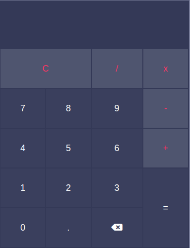

<h1>Calculadora em React</h1>

Projeto desenvolvido com HTML5, CSS3 e React

O projeto atende as quatro operações basicas da matemática (soma, subtração, multiplicação e divisão)

Para testar o projeto desenvolvido, realizar o passo a passo abaixo.

<ul>
  <li>Clonar o projeto em qualquer pastas do seu sistema</li>
  <li>Entrar na pasta raiz</li>
  <li>Executar o comando npm install</li>
  <li>Executar o comando npm run start</li>
</ul>
